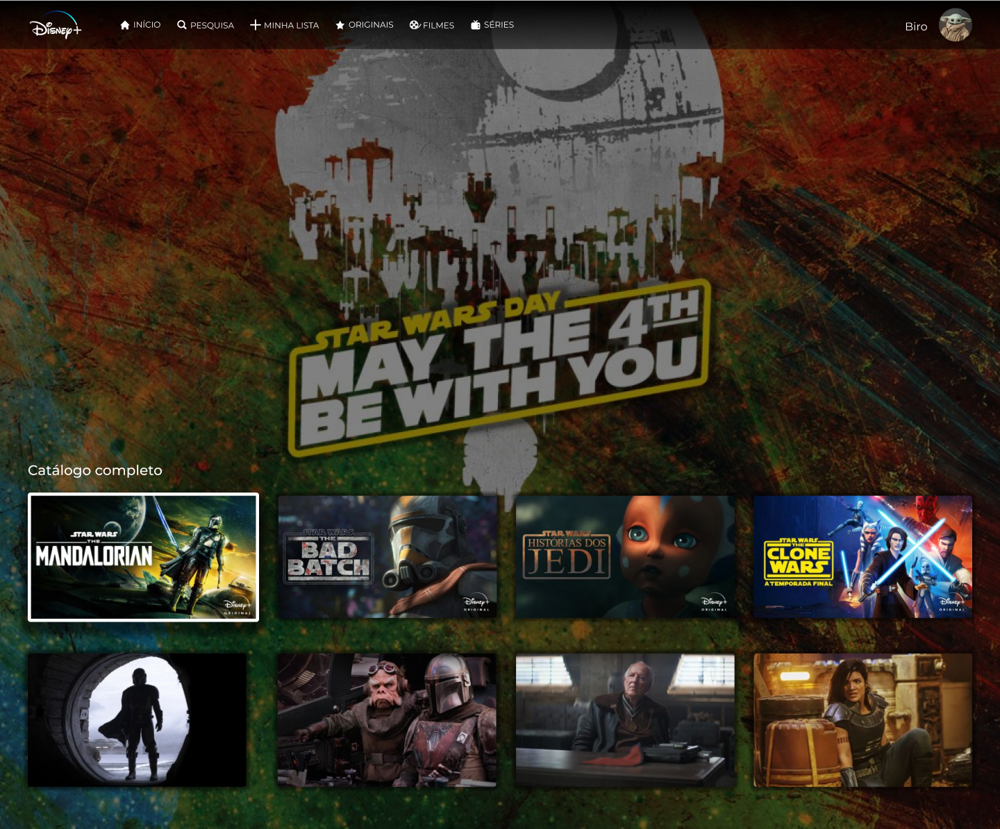

<h1 align="center"> Projeto Layout Disney Plus</h1>

O Explorer é um programa completo que reúne tudo o que você precisa para desenvolver suas habilidades técnicas e comportamentais, com acompanhamento de uma equipe qualificada da Rocketseat, para alcançar sua primeira vaga no mercado de programação.  

  <a href="#-tecnologias">Tecnologias</a>&nbsp;&nbsp;&nbsp;|&nbsp;&nbsp;&nbsp;
  <a href="#-projeto">Projeto</a>&nbsp;&nbsp;&nbsp;|&nbsp;&nbsp;&nbsp;
  <a href="#-layout">Layout</a>&nbsp;&nbsp;&nbsp;|&nbsp;&nbsp;&nbsp;
  <a href="#memo-licença">Licença</a>

  

 

  

## 🚀 Tecnologias

Esse projeto foi desenvolvido com as seguintes tecnologias:

- HTML e CSS
- Git e Github
- Figma

## 💻 Projeto

O projeto consiste em criar uma landing-page básica para aplicar os conhecimentos de HTML e CSS.

## 🔖 Layout

Você pode visualizar o layout do projeto através [DESSE LINK](<https://www.figma.com/file/U3ULoI9nuAeQQZuk2CyguD/Disney-Plus--Star-Wars-(Copy)?type=design&node-id=0-1&mode=design&t=hKGoEQHNc7VdgTsZ-0>). É necessário ter conta no [Figma](https://figma.com) para acessá-lo.

## :memo: Licença

Esse projeto está sob a licença MIT.

---

Feito com ♥ by Lucas :wave: [Participe da comunidade da RocketSeat!](https://discord.gg/rocketseat)
